# 《猫友记》作品信息

- **作品类别**：软件应用与开发-移动应用开发（非游戏类）
- **作品编号**：2022035836
- **作品名称**：《猫友记》

------

### 作品简介

​	目前市面上缺乏集合满足猫友之间交流、搜索小猫、猫咖信息的小程序或app，而我们写的猫友记恰好看准了这块市场，搭建了一个能满足上述条件的基础猫友交流环境。本项目主要具有如下几个功能：

1. 猫咪、猫咖查询功能
   - 根据文字（猫咪名称、店铺名称）查询
2. 猫咖推荐功能
   - 根据店铺地址与用户所在城市以及店铺热度等信息进行推荐
3. 猫咪排行榜功能
   - 根据热度从大到小对猫咪进行排序，热度值受用户评分影响。实现了用户与猫咪的交互功能
4. 允许对猫咪进行评分和评价，发出的评价所有用户可见，允许所有用户对评论进行回复
5. 交友功能
   - 主页的“寻找猫友”可使用户匹配到志同道合的好友，用户可以选择是否添加为好友
   - 各用户都可通过添加心动猫咪来添加评论，并在评论下方进行回复，和其他用户进行线上交流
6. 提供各类猫咪相关知识，用户可以查看猫咪图鉴、猫咪新闻，丰富该平台内容
7. 有一个猫咪知识问答模块，可进行趣味答题，检验用户对猫咪的了解程度

​	详细功能介绍可见于“**设计思路**”部分，具体演示可查看给出的GitHub网址中的演示视频。

##### 开发背景

​	目前城市里兴起了许多的猫咖店（在美团平台上搜索“猫咖”相关结果就多达六百多条），他们用各种各样的猫咪和相关服务吸引客户来店里消费，但在客户消费的过程中往往会遇到各种各样的问题：

1. 到店后发现没有自己喜欢的猫咪类型；
2. 到店后才发现店铺的环境和服务差强人意，和店家自己宣传的有出入；
3. 平时看到喜欢的猫咪，却不清楚品种、不方便买、也不知道哪里可以看到；
4. 找不到志同道合、有相同猫咪爱好的朋友等等。

​	本项目旨在通过猫友记微信小程序让各网友都能体会到符合期望的使用体验。

##### 开发工具

| 前端设计工具 |       后端数据库       |  代码开发工具  |
| :----------: | :--------------------: | :------------: |
|     墨刀     | 微信小程序云开发数据库 | 微信开发者工具 |

------

### 开源组件说明

​	本项目使用了**微信云开发**进行编写，使用了其中部分组件，其中主要用到的是云数据库。

​	数据库文件可访问GitHub网址进行查看。

------

### 安装说明

**无登陆版本**因为通过了审核，所以用**微信**点击如下链接便可直接使用：

#小程序://Hi喵/哈喽小猫咪/XzMvm3AXxlCA58B

**带登录版本**因为涉及用户隐私等网络安全问题，通过审核的步骤较繁琐，所以需要安装《微信开发者工具》进行查看：

1. 下载并解压代码链接中的code.zip压缩包
2. 压缩包内有两个文件夹`login`以及`no_login`，前者就是带登录版本小程序源文件，后者为无登录版本
3. 打开《微信开发者工具》
4. 将需要查看的代码文件夹导入项目
5. 点击确定即可查看小程序虚拟演示以及所有代码文件

------

### 作品效果图

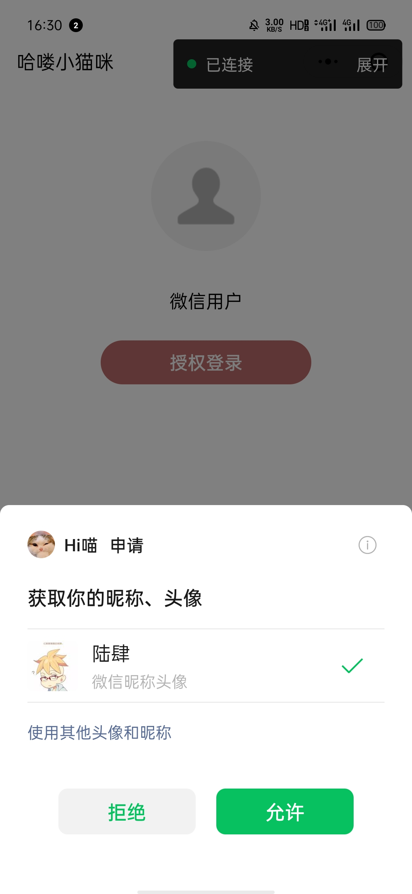

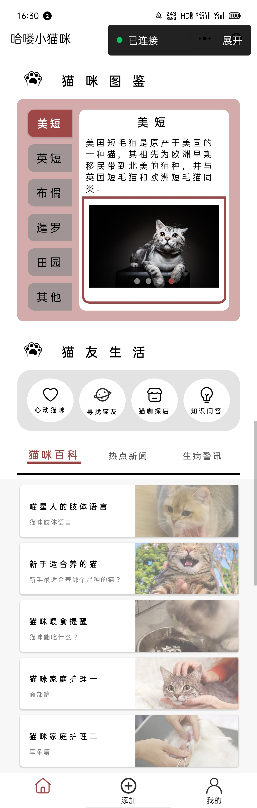

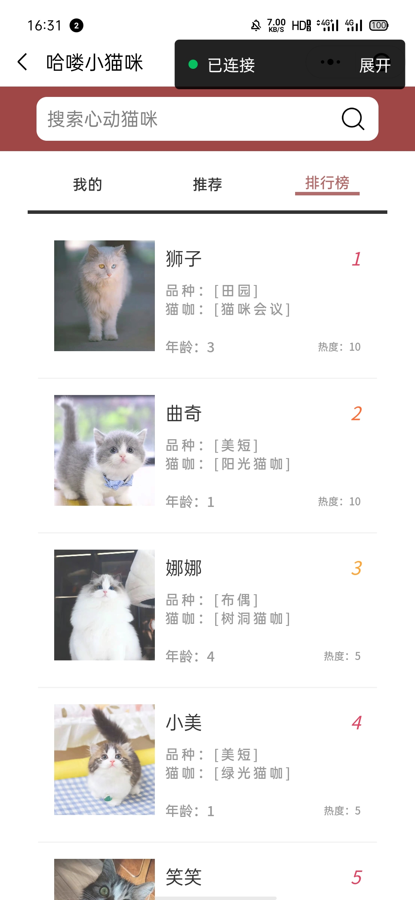

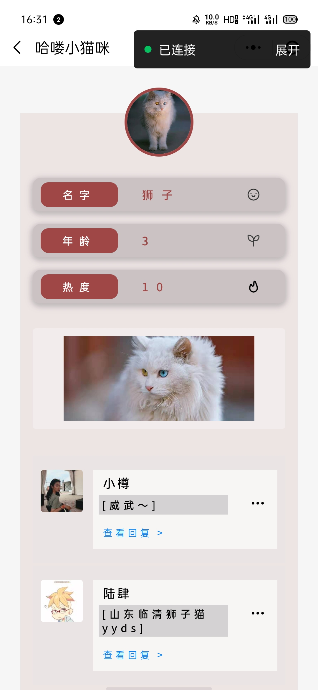

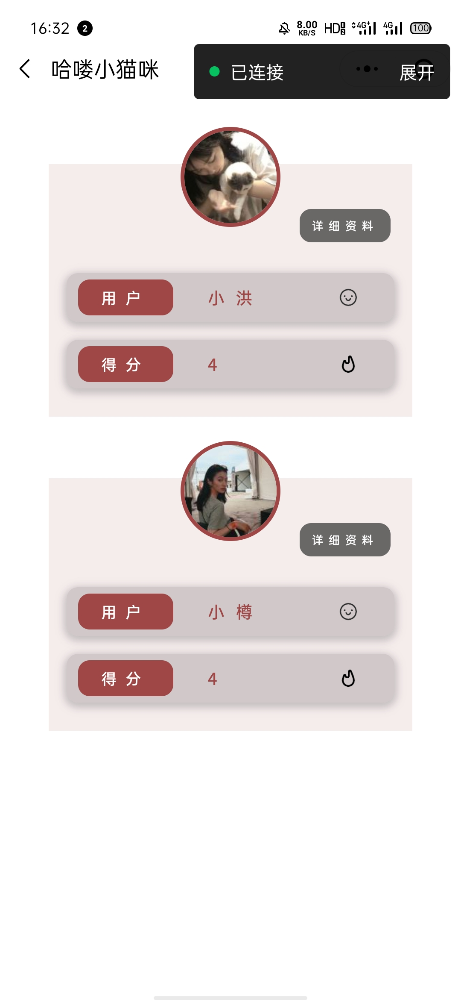

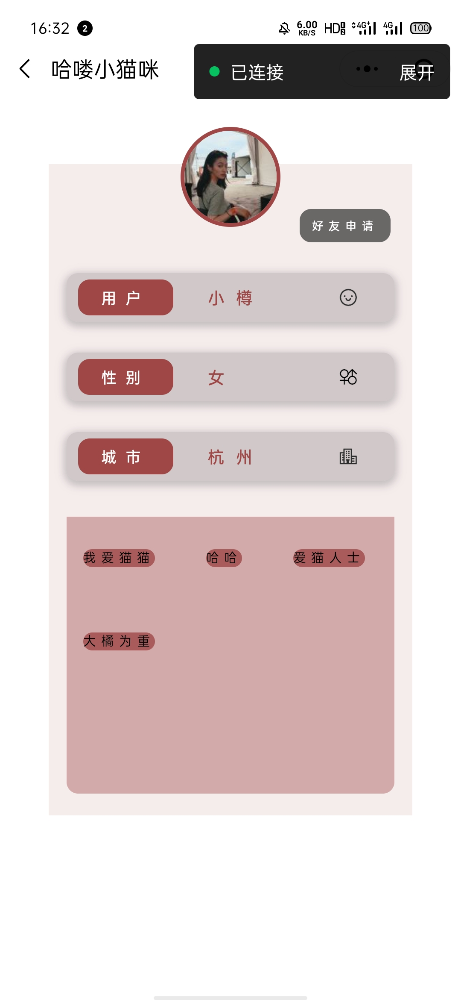

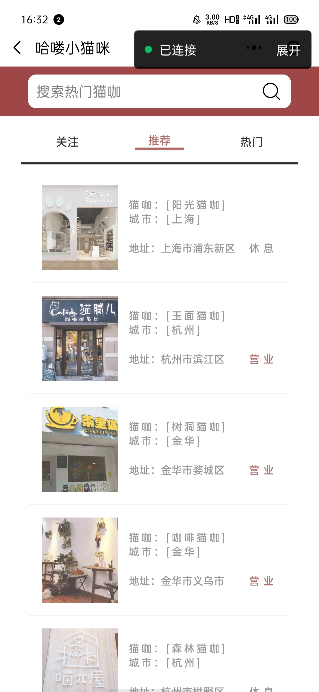

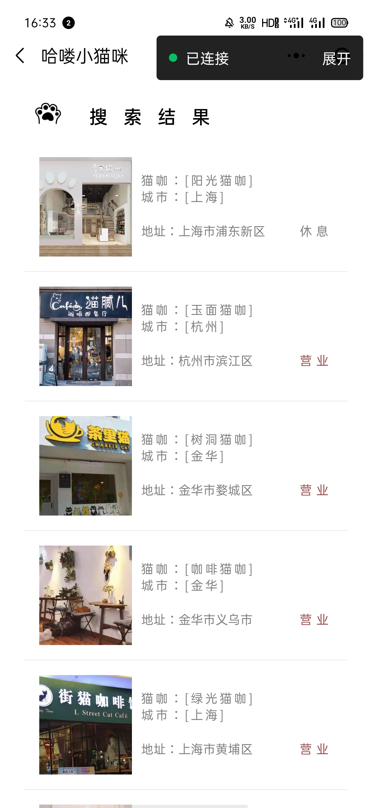

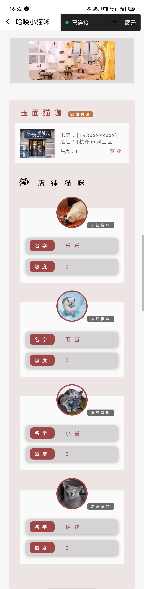

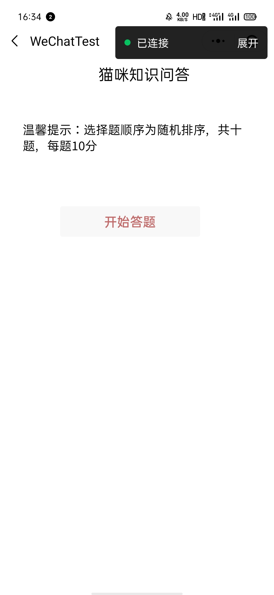

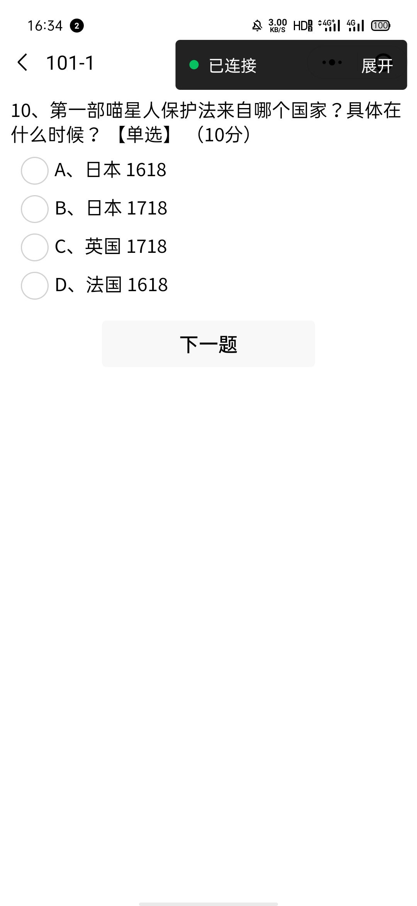

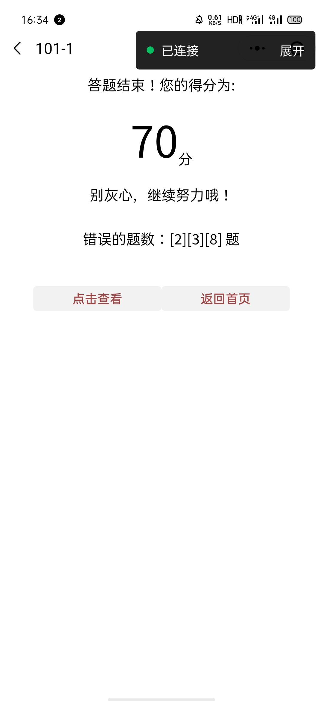

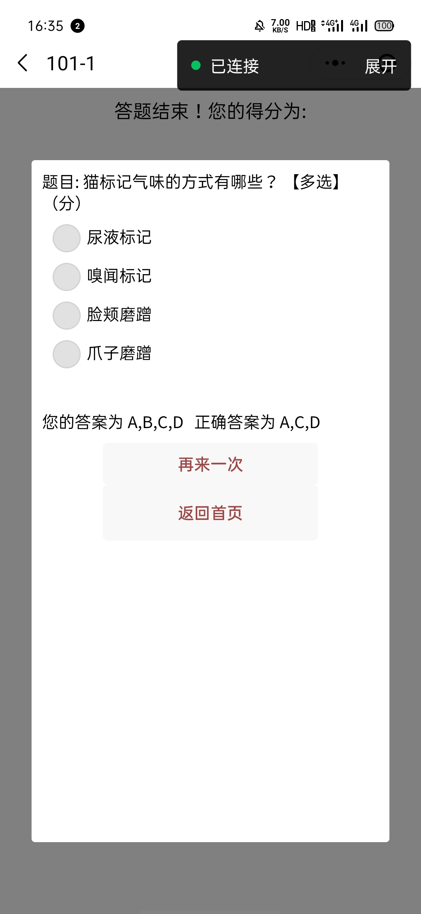

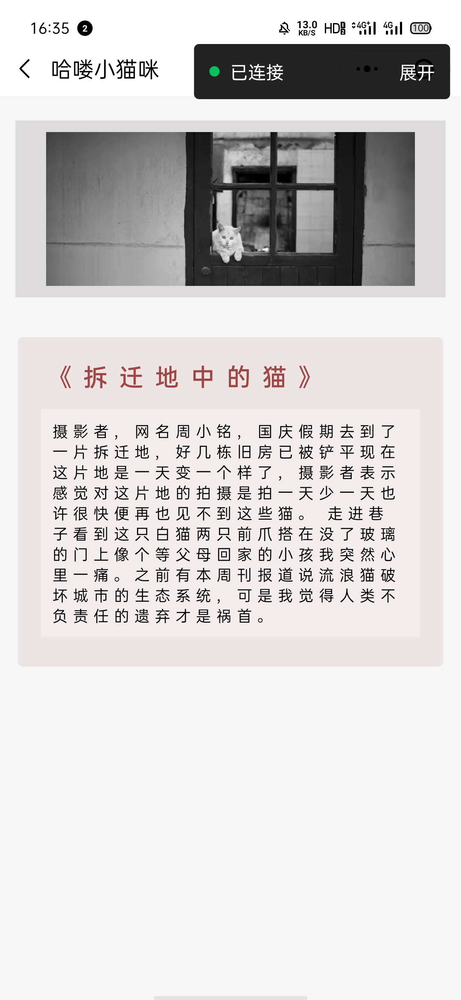

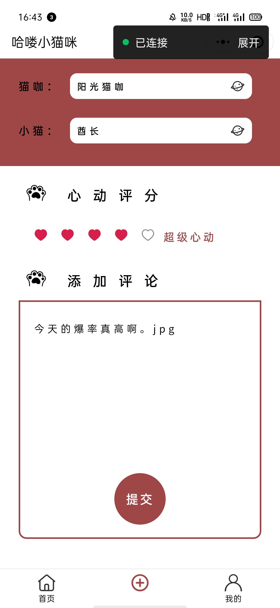

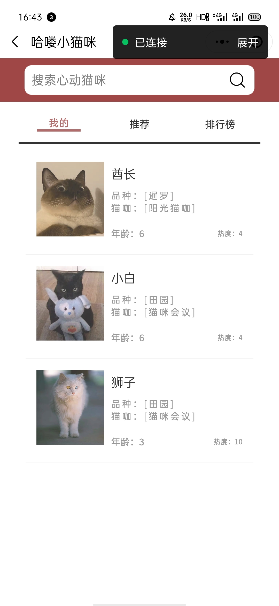

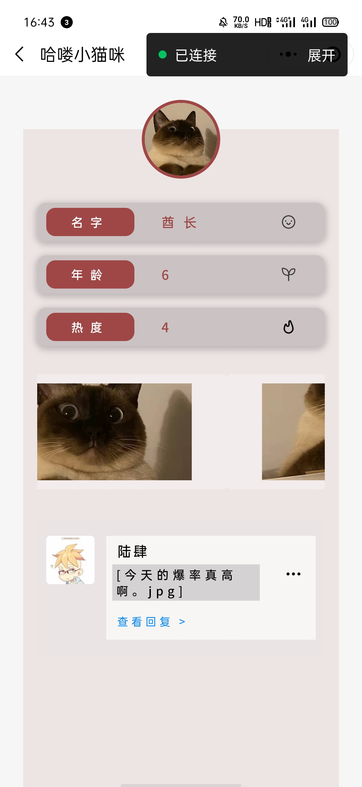

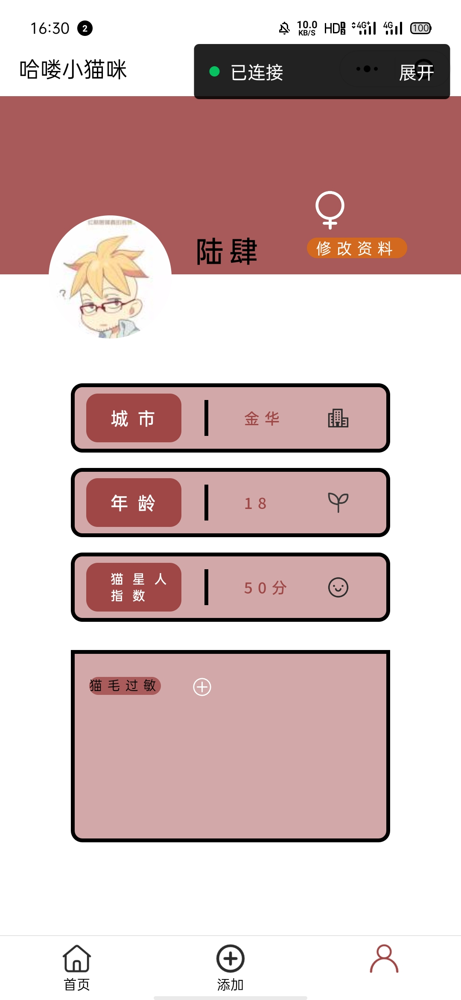

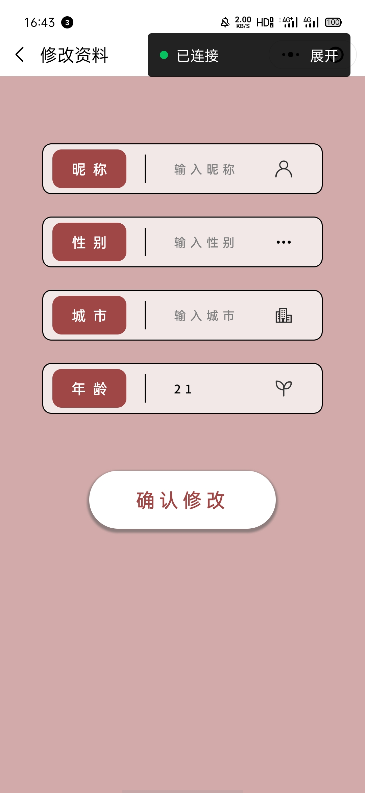

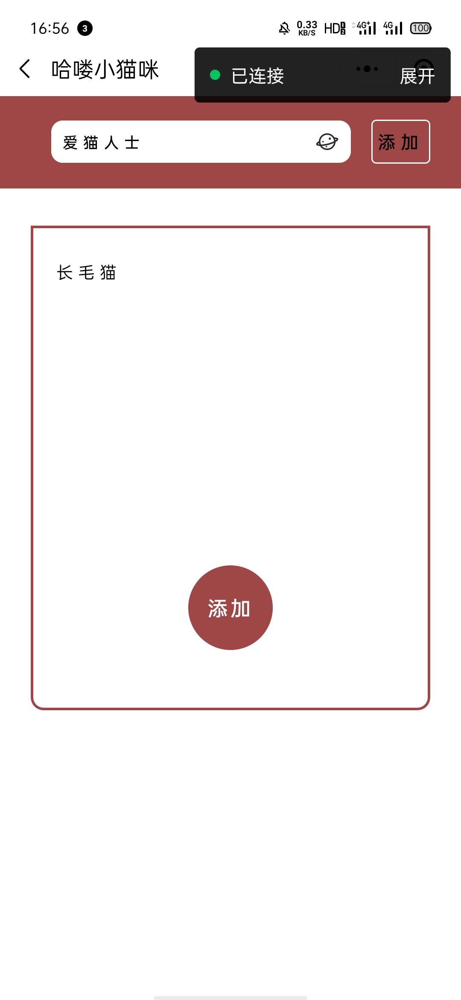

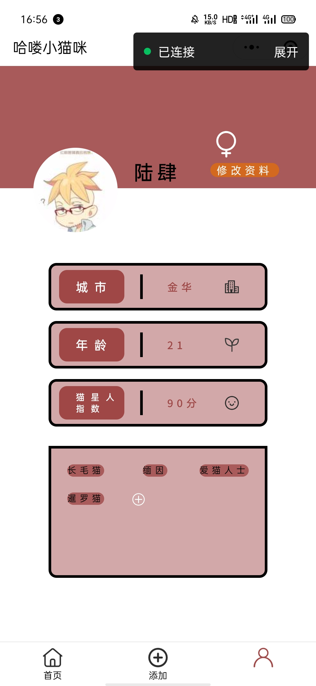

### 设计思路

1. ##### 登录

   - 采用了微信授权登录方式。
   - 直接获取对应的用户信息（头像、用户名、性别等）。
   - 所在城市默认为杭州。
   - 年龄默认为18岁。
   - 猫星人指数默认为0。
   - 用户标签、关注店铺、心动猫咪默认为空。

2. ##### 主页——分为三大部分

   - **猫咪图鉴**
     - 该部分是对几种常见猫咪知识的简要介绍以及对应种类的猫咪图片，用于小程序内容的增色。
     - 每小页使用轮播的图片来向用户动态展示不同种类猫咪的信息。
     - 左侧的菜单栏可以点击更换查看的猫咪品种，相对应的标题、种类简介和轮播的图片都会更换。
   - **猫友生活**
     - **心动猫咪**
       - 根据“我的”、“推荐”、“排行榜”三种分类，可以分别按照不同的顺序分类方式查看不同的猫咪。
       - 每只猫咪的信息卡片内都有关于它的照片、品种、年龄、从属猫咖以及根据用户的评分和评价生成的热度值。
       - 允许用户根据猫咪姓名进行查找，查找成功过后会自动跳转到查找结果界面。
       - “我的”部分显示的猫咪都是用户评论过的小猫咪。
       - “推荐”部分是根据用户标签等信息进行推荐的可能用户会喜欢的猫咪。
       - “排行榜”部分会在右边显示猫咪热度排名，并根据热度从大到小对猫咪进行排序，热度值受用户评分影响。
       - 点击猫咪信息卡片后即可跳转至对应猫咪的详情页面。猫咪详情界面除了会显示猫咪的基本信息外，还会显示更多的猫咪图片，另外还会显示各用户对该猫咪的评价信息，用户可查看这些评论及其回复，也可对这些评价进行回复。
     - **寻找猫友**
       - 点击即可进入一个有显示“开始搜索”字样的砖红色按钮的界面，点击“开始搜索”按钮即可进入猫友搜索结果界面
       - 系统会根据用户所给出的评论信息和用户自己设置的标签，计算与用户的配值，达到为其匹配志同道合的朋友的目的
       - 搜索结果页面会显示用户信息小卡片，上面现时由用户头像、用户名、用户匹配得分，可点击“详细资料“按钮进入用户信息详情界面
       - 用户信息详情界面还会另外显示用户性别、所在城市以及标签等信息，可点击”好友申请“按钮添加猫友
     - **猫咖探店**
       - 根据“我的”、“推荐”、“热门”三种分类，可以分别按照不同的顺序分类方式查看不同的猫咖店铺。
       - 每家猫咖的信息卡片内都有关于它的照片、名称、所在城市、地址以及营业状况。
       - 允许用户根据猫咖名称进行查找，查找成功过后会自动跳转到查找结果界面。
       - “我的”部分会显示用户关注的所有店铺。
       - “推荐”部分是根据用户标签、所在城市等信息进行推荐的可能用户会喜欢的猫咖。
       - “热门”部分会根据各猫咖的热度进行排序。
       - 点击猫咖信息卡片后即可跳转至对应猫咖的详情页面。猫咖详情界面除了会显示猫咖的基本信息外，还会显示更多的猫咖图片以及猫咖的联系电话、热度，另外还会显示该店铺内的所有猫咪，用户可点击这些店铺猫咪小卡片中的”详细资料“按钮查看猫咪的详细信息。
     - **知识问答**
       - 共10道关于猫咪的趣味题，有单选题也有多选题，从题库中随机抽题，所以每次答题题目顺序和内容都会有不同。
       - 答对会累计相应的分数，分数会记录到”我的“界面中的”喵星人指数“中，每答出一个更高分就会更新。
       - 不同的分数分等级会有不同的评语。每一题不可空白作答，会有相关提醒。
       - 作答结束后，会显示用户的得分情况，错在哪几题上。并且可以点击查看每一道错题的错选答案和正确答案，或者可以直接返回首页。
   - **猫咪新闻百科**
     - 有三类资讯供用户切换查看，分别是：猫咪百科、热点新闻、生病警讯。
     - 每一类资讯都是一个可以滑动的列表，一条资讯包括标题，简介和图片。
     - 每一条资讯都可以点击进入，查看详细描述，包括对应的图片，标题和小短文。

3. ##### 添加

   - 可选择一家店铺中的一只猫咪对其进行评分和评论。编辑完成后点击添加可为对应猫咪增加评论和热度。
   - 在最上方的多选框部分，用户可在给出的库中选择想要评论的猫咖店铺，系统会根据选择的猫咖店铺在下一条小猫选项中更新数据库，使用户只能选择上述猫咖店铺中现有的猫咪。
   - 在中间的”心动评分“部分，用户可以给猫咪打分，1-5分，界面上设计了5颗小爱心，用户将其点亮即可。打好分数并上传后会给对应小猫咪增加相应热度值。
   - 在最下方的”添加评论“部分，用户可以自由书写对猫咪的评论，并点击最下方的“提交”按钮，即可完成对某一只猫咪的评论。用户添加的评论都会显示到对应猫咪的详细信息里，对所有用户可见。
   - 点击”提交“按钮后，不仅会给对应猫咪增加相应的热度值、评论，还会将该猫咪加入用户”心动猫咪-我的“的列表中。

4. ##### 我的

   - 根据不同的用户登陆会对应呈现不同的内容。用户可以编辑个人资料、添加个人标签。
   - 点击”修改资料“按钮即可跳转至信息修改界面，可对用户昵称、性别、城市、年龄进行修改
     - 改变性别的话会改变”修改资料“上方的性别图标。
   - ”喵星人指数“由用户在”主页-猫友生活-知识问答“部分获得的最高分决定，初始默认为0分。
   - 最下方的方框就是显示用户标签的区域，可通过点击白色加号图标，跳转到添加标签的界面。
     - 允许用户添加数据库中固有的标签。
     - 也允许用户添加自定义标签。

### 重点难点

​	重点难点主要在”主页-猫友生活“以及”添加心动猫咪“这两大部分上。

- 心动猫咪、猫咖探店中的每一个大类都有不同的筛选和排序方式，特别是猫咪热度排行榜，需要根据各个用户的评分对对应猫咪进行计算。
- 寻找猫友的匹配得分算法也是一个小创新。
- 知识问答部分则是实现”多种题型“、”从题库中随机抽取固定题目数量“等重要功能，实现过程十分繁琐。
- 添加心动猫咪后就能自动为对应猫咪添加平理论增加热度，两者会进行关联。且任何用户都可对该评论进行回复，达到社交的效果。

### 其他说明

​	考虑到文字和图片可能无法完美表述本项目的功能，所以我们组除图文说明外，还有运行过程录屏可供观看。

​	更详细的作品介绍可跳转至本项目的GitHub网址查看。

​	
